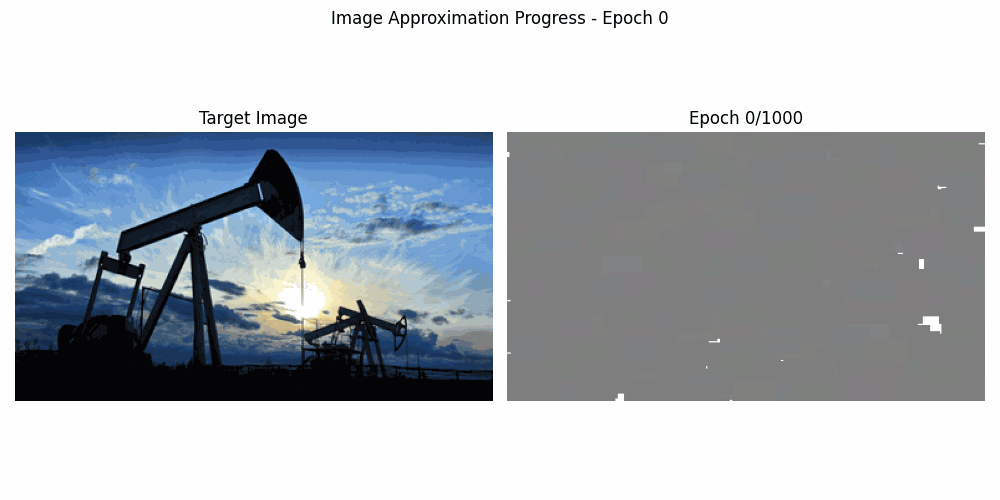

# PyEvo: Evolutionary Optimization Algorithms in Python

A Python implementation of various evolutionary optimization algorithms for black-box optimization in high-dimensional continuous domains, including Separable Natural Evolution Strategies (SNES), Covariance Matrix Adaptation Evolution Strategy (CMA-ES), and Particle Swarm Optimization (PSO).

## What is SNES?

Separable Natural Evolution Strategies (SNES) is an evolutionary algorithm that excels at optimizing:
- High-dimensional problems (hundreds or thousands of parameters)
- Non-differentiable objective functions
- Multimodal landscapes with many local optima
- Problems where gradient information is unavailable

SNES works by:
1. Maintaining a normal distribution over the search space (with mean μ and standard deviation σ)
2. Sampling solutions from this distribution
3. Evaluating the fitness of each solution
4. Adjusting μ and σ based on the fitness rankings (not absolute values)

The "separable" aspect means each dimension is treated independently, which reduces computational complexity and makes the algorithm suitable for high-dimensional problems.

## Included Optimization Algorithms

This package includes multiple black-box optimization algorithms:

1. **SNES (Separable Natural Evolution Strategies)**
   - Fast, efficient algorithm for high-dimensional optimization
   - Diagonal covariance matrix (treats dimensions separately)
   - Linear time complexity with respect to problem dimensionality

2. **CMA-ES (Covariance Matrix Adaptation Evolution Strategy)**
   - Powerful, state-of-the-art evolutionary algorithm
   - Full covariance matrix adaptation (can capture parameter interactions)
   - Quadratic time complexity with respect to problem dimensionality
   - Better for problems with parameter dependencies

3. **PSO (Particle Swarm Optimization)**
   - Nature-inspired algorithm based on social behavior
   - No probability distribution modeling
   - Often faster convergence on simple problems
   - Can get trapped in local optima more easily than ES methods

## Core Features

- Clean, NumPy-based implementation optimized for performance
- Flexible API with sensible defaults
- Comprehensive documentation and examples
- Minimal dependencies (just NumPy)
- Vectorized operations for efficient computation
- Parallel processing support for fitness evaluation
- Early stopping to avoid wasted computation
- Checkpointing for long-running optimizations
- Progress tracking and statistics
- **Multiple optimization algorithms with a unified interface**

## Installation

```bash
pip install pyevo
```

Or directly from the repository:

```bash
git clone https://github.com/AntonioLujanoLuna/pyevo.git
cd pyevo
pip install -e .
```

### Requirements
- Python 3.6+
- NumPy (core dependency)
- Additional dependencies for examples and visualization (automatically installed with `pip install -e ".[examples]"`)

### Optional Dependencies
- GPU Acceleration: `pip install cupy>=12.0.0`
- Video Creation: `pip install "imageio[ffmpeg]"`
- All Example Requirements: `pip install -e ".[all]"`

## Quick Example

```python
import numpy as np
from pyevo.utils import create_optimizer

# Define objective function (minimize x^2)
def objective(x):
    return -np.sum(x**2)  # Negative because optimizers maximize

# Initialize optimizer (50-dimensional problem)
# You can choose between 'snes', 'cmaes', or 'pso'
optimizer = create_optimizer(
    optimizer_type='snes',  # Try 'cmaes' or 'pso' as well
    solution_length=50
)

# Run for 100 iterations
for i in range(100):
    # Get population of solutions
    solutions = optimizer.ask()
    
    # Evaluate fitness for each solution
    fitnesses = [objective(x) for x in solutions]
    
    # Update optimizer
    improvement = optimizer.tell(fitnesses)
    
    # Print progress
    if i % 10 == 0:
        best = optimizer.get_best_solution()
        print(f"Iteration {i}, Best fitness: {-np.sum(best**2):.6f}")
        
    # Early stopping if no improvement
    if improvement < 1e-6:
        print("Early stopping: no improvement")
        break
```

## Examples

This repository includes examples demonstrating the optimization algorithms in action:

1. **ASCII Evolution**: Evolving text to match a target string
   ```bash
   python examples/ascii_example.py
   ```

2. **Image Approximation**: Approximating images using rectangles
   ```bash
   python examples/image_approx.py --image examples/resources/image.jpg --rects 200 --output-dir examples/output
   ```
   
   This example demonstrates approximating an image using rectangles evolved with SNES. The script includes:
   - Vectorized operations for efficient computation
   - Parallel processing for fitness evaluation
   - Support for creating animated GIFs of the optimization process
   - Automatic output directory management
   - Progress visualization with tqdm progress bar
   - Early stopping to avoid wasted computation
   - Checkpointing for long-running optimizations
   
   Additional options:
   - `--max-size`: Maximum size for the image (default: 128)
   - `--epochs`: Number of generations to evolve (default: 1000)
   - `--population`: Population size (default: 32)
   - `--alpha`: Learning rate (default: 0.05)
   - `--gif-frames`: Number of frames in the evolution GIF (default: 50)
   - `--gif-fps`: Frames per second in the GIF (default: 10)
   - `--workers`: Number of worker processes for parallel fitness evaluation
   - `--early-stop`: Early stopping tolerance (default: 1e-6)
   - `--patience`: Number of epochs to wait before early stopping (default: 10)
   - `--checkpoint`: Path to save optimizer checkpoint
   - `--no-display`: Disable live progress visualization

### Algorithm Comparison 

Compare the performance of different optimization algorithms on standard benchmark functions:

```bash
python examples/optimizer_comparison.py
```

This example:
- Runs SNES, CMA-ES, and PSO on various benchmark functions
- Compares convergence speed and final solution quality
- Generates plots showing performance over time
- Reports runtime statistics for each algorithm

Additional options:
- `--dimensions`: Dimensionality of the test problems (default: 10)
- `--iterations`: Maximum number of iterations (default: 300)
- `--trials`: Number of trials to run per algorithm (default: 3)
- `--output`: Directory for output plots and data
- `--benchmarks`: Benchmark functions to use (default: sphere, rosenbrock, rastrigin)
- `--optimizers`: Algorithms to compare (default: snes, cmaes, pso)

### Image Approximation Results

Here's an example of the image approximation capabilities of SNES:

#### Original vs. Approximated Image

<table>
  <tr>
    <td></td>
    <td></td>
  </tr>
  <tr>
    <td>Original Image</td>
    <td>Approximated with 750 rectangles (PSNR: 18.03 dB)</td>
  </tr>
</table>

#### Evolution Process

This animation shows how the image approximation evolves over time:

<p align="center">
  
</p>

The approximation was generated using:

```bash
python examples/image_approx.py --image examples/resources/image.jpg --rects 750 --max-size 384 --display-interval 5 --gif-frames 50 --population 24
```

## Advanced Features

### Parallel Processing

For computationally intensive fitness functions, you can use parallel processing:

```python
from concurrent.futures import ProcessPoolExecutor
import functools

def parallel_fitness(solutions, objective_func, max_workers=None):
    """Evaluate fitness of multiple solutions in parallel."""
    with ProcessPoolExecutor(max_workers=max_workers) as executor:
        return list(executor.map(objective_func, solutions))

# In your optimization loop
fitnesses = parallel_fitness(solutions, objective, max_workers=4)
```

### Interactive Mode

PyEvo provides an interactive mode that allows you to control optimization runs in real-time:

```python
from pyevo import SNES
from pyevo.utils.interactive import InteractiveOptimizer

# Define your objective function
def objective(x):
    return -np.sum(x**2)  # Negative because SNES maximizes

# Create SNES optimizer
optimizer = SNES(solution_length=20)

# Create interactive optimizer wrapper
interactive = InteractiveOptimizer(
    optimizer=optimizer,
    fitness_function=objective,
    max_iterations=1000,
    checkpoint_dir="checkpoints"
)

# Start interactive optimization
best_solution, best_fitness = interactive.start()
```

During optimization, you can enter any of these commands in the terminal:
- `pause` - Pause the optimization
- `resume` - Resume the optimization
- `stop` - Stop the optimization
- `stats` - Show detailed statistics
- `save` - Save a checkpoint of the current state
- `alpha <value>` - Adjust the learning rate multiplier
- `params` - Show current optimizer parameters
- `help` - Show all available commands

You can also run a full example:
```bash
python examples/interactive_example.py --dimensions 50 --max-iterations 2000
```

The interactive mode is particularly useful for:
- Long-running optimizations that may need adjustment
- Experimenting with different learning rates
- Saving intermediate results
- Monitoring progress in real-time

### Early Stopping

SNES supports early stopping to avoid wasted computation:

```python
# In your optimization loop
improvement = optimizer.tell(fitnesses, tolerance=1e-6)
if improvement < 1e-6:
    print("Early stopping: no improvement")
    break
```

### Checkpointing

Save and load optimizer state for long-running optimizations:

```python
# Save optimizer state
optimizer.save_state("checkpoint.npz")

# Later, load the state and continue
from snes import SNES
loaded_optimizer = SNES.load_state("checkpoint.npz")

# Continue optimization
solutions = loaded_optimizer.ask()
# ...
```

## Output Files

By default, output files (images, GIFs, checkpoints) are saved to:
- `examples/output/` - For generated images and animations
- `examples/checkpoints/` - For optimizer checkpoints

You can customize these paths using the `--output-dir` and `--checkpoint-dir` arguments.

## License

This project is licensed under the MIT License - see the [LICENSE](LICENSE) file for details.

## Contributing

Contributions are welcome! Please feel free to submit a Pull Request.

## Author

Antonio Lujano Luna ([@antonio-lujano-luna](https://github.com/AntonioLujanoLuna))